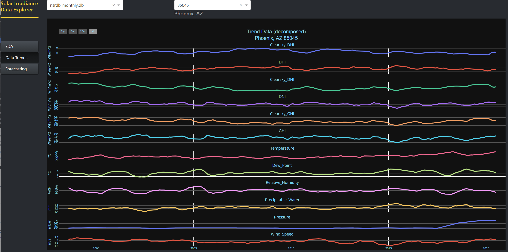

# United States Residential Solar<br>Photovoltaic Panel Adoption
## A University of Michigan MADS Capstone Project

**[Master of Applied Data Science](https://www.si.umich.edu/programs/master-applied-data-science-online)**  
**[School of Information](https://www.si.umich.edu/)**  
**[University of Michigan](https://umich.edu/)**  

## Project Collaborators
> Collin Brosko  
> Greg Myers  
> Robert Underhill  
> Monica Yen  


Table of contents
==============
   * [Visit our Blog Post and Dashboard](https://pv-solar-697.herokuapp.com/apps/blog) - HTML
   * [About](#about)  
   * [Project Goals](#goals)  
   * [Key Learning](#learning)  
   * [Usage](#usage)  
   * [Future Work](#future)  
   * [Python Environment](#enviro)  
   * [Credits & Interviews](#credits)  
   * [Licence](#MIT)  

## About<a name="about"/>

##### Project Background  
  
The [Energy Information Administration](https://www.eia.gov/energyexplained/us-energy-facts/) stated that 17% of retail energy sales in the United States were to the residential sector. With a growing fleet of electric vehicles and increased conversions of residential systems to electricity (ie heating), this number can be expected to grow. Photovoltaic installations at this point of use may offer both tremendous benefits as well as unique issues. This project is about gaining a better understanding of the numerous factors impacting the adoption of photovoltaic panels in the residential setting in order to determine which areas are most likely to see a growth in adoption, which areas could see increased adoption with changes to human-controlled factors, and which areas may be best avoided. We are looking to analyze changes in environmental factors due to climate change, the changing cost per Watt of energy versus utility rates, the impacts of policies and incentives as well as sentiment toward renewable energy and solar energy in particular. The output of this work is likely to be multi-faceted, incorporating predictions of adoption rates for regions, identification of weaknesses within a region, and ratings for investment potential within an area. This work is not intended to provide analysis of individual homes, but would rather benefit government, utility and business entities in assessing larger regions.

## Project Goals<a name="goals"/>

The goal of this project is to provide insights into three primary drivers of residential solar adoption: irradiance and meteorological features, economic features, and policy or programmatic features.  

Irradiance and Meteorological Data  
- Provide irradiance data at the **ZIP Code** level, accessible via a portable **SQL** database.  
- Provide **data trends** visualizations of irradiance and meteorological data.  
- Provide basic **Exploratory Data Analysis** visualizations.  
- Present all visualizations through an interactive dashboard [Solar Irradiance Data Explorer](https://pv-solar-697.herokuapp.com/) called SIDE-dash  

  

Economics  
- The main goal was to identify the potential economic drivers for solar installation. 
- Once identified, it would be necessary to create cost forecasts for the next 10 years due to the long-term return in investment for solar technology.

Policy and Programmatic  
- Determine the primary factors in the decision to install solar panels
- Provide an increased understanding of the effectiveness of different policy and program types
- Provide a means of evaluating individual programs


## Key Learning<a name="learning"/>

This work provides understanding of the direction in which factors impacting solar adoption are either headed or where it would be beneficial for actions to take place.  

Irradiance and Meteorological  
- The key learning from the collection of solar irradiance data is that the radiation at a given location is not fixed and is susceptible to a variety of influences beyond the seasonal tracking of the sun across the sky. 
  - Clouds, water vapor, smoke, dust, and other fine particulate matter all have a bearing on the solar radiation the ultimately arrives at the earth’s surface.
  - Some of these influencers, while not individually indicated, do make themselves known through the “Trend View” on [SIDE-dash](https://pv-solar-697.herokuapp.com/apps/app2). You are invited to visit and explore for yourself!

Economics  
- The states that had higher than average energy costs tended to have a higher-than-average number of installations. With the limited amount of installations, there currently is now negative or positive trend of cost of installation. This will likely change has the technology improves and the number of installations increases (economies of scale). 
- The cost of energy at the state level has gone through a significant shift over the past ten years. States that were once at the bottom of the ranking, are near the middle or top currently.
- The economically ideal location for residential solar technology, are not always the places where solar technology will thrive (i.e Vermont).  

Policy and Programmatic  
- The primary factors in determining whether to install solar panels are the amount of sun available along with the cost of electricity in the area. The cost of installation showed to be significant, however less so. Certain programs demonstrate a significant ability to impact adoption as well.
- Programs which impact taxes, whether through personal tax credits/ deductions or property tax incentives, proved to be very effective along with programs impacting long term payback, such as feed-in tariffs or value of solar tariffs. Programs that offered grants and rebates were shown to be far less effective.
- Individual program specifics within a program type can vary greatly, resulting in a need for individual program analysis.  

## Usage<a name="usage"/>

### Irradiance and Meteorological Data  
##### Database preparation  
If needed the zipcode_import.ipynb notebook is used to move data from a CSV file of ZIP Code data into the geo_zipcodes.db database. This is generally no longer required.  

A series of notebooks (or a python script) are used to ready the irradiance database. If you do not have a downloads directory structure in your local fork of this repo, execute the create_downloads_dir.ipynb notebook for a default setup. Because of the volume of data brought down from [NREL API server](https://developer.nrel.gov/docs/solar/nsrdb/psm3-download/), the downloads folder is explicity ignored in the .gitignore file. Within the newly created local ./downloads/zip_codes/ directory will be placed the zipcodes.txt file that contains the ZIP Codes of interest. This is a simple text file of one Zip Code per line.  
Example file structure:  
```txt
12019
12027
12186
12196
12309
```
Once processed zipcodes.txt is renamed.  

The zipcodes_get_geos.ipynb notebook is used to query the geo_zipcodes.db and extract lat/lon coordinates for each ZIP Code pulled from the previously mentioned zipcodes.txt file. zipcodes_get_geos.ipynb produces a YAML file that is used by the NREL API download script.  

The nsrdb_download.ipynb notebook (or .source/nsrdb_download.py for terminal usage) has several responsibilities, the first of which is to instantiate the irradiance database and the two tables within. The ‘nsrdb’ table is a standard “CREATE TABLE…” query and the ‘geo_zipcodes’ table is an “INSERT INTO…” query from the geo_zipcodes.db.  

The NREL API query process now begins requesting data for each ZIP Code for each year between 1998 and 2020 (see [./notebooks/nsrdb_download.ipynb](./notebooks/nsrdb_download.ipynb) for more information). Each received CSV file is processed and saved in two forms, a data file and a metadata file. Simultaneously, each data CSV is written to the ‘nsrdb’ table of the irradiance database and certain fields are extracted from the metadata and inserted into the ‘geo_zipcodes’ table and the geo_zipcode.db database. This notebook will produce a database of hourly data based on the NREL downloads.  

The current final step is to execute the nsrdb_aggregator notebook which, at present, performs initial steps similar to that of the nsrdb_download script. Then, rather than querying the NREL API, the saved raw data is processed into monthly aggregated data and saved to a database similar to that created by nsrdb_download. The current aggregation level is by month but this could expand in the future.  

A future project would be to combine the API download and aggregation into a single process, and for multiple levels of aggregation.  

##### Dashboard
Please be patient when first accessing [SIDE-dash](https://pv-solar-697.herokuapp.com/), the initial standup on [Heroku](https://heroku.com/) may take 30-seconds or so to load.  

The dashboard should load to the EDA page which presents two dropdowns for data selection. The first is for database selection of which there is currently one available on the Heroku sight. The second dropdown allows for the selection of a ZIP Code and the data behind it. The EDA page presents four views, Irradiance Data, Distribution, Meteorological, and Descriptive Statistics. The Data Trends page has like dropdowns for data selection.  

  

The Forecasting page adds a third dropdown for selecting the specific data feature on which to forecast. Note that the Forecasting page defaults to not perform a traditional Seasonal Differencing forecast. The traditional method is computationally much more expensive than the Fast Fourier Transform method and should generally be avoided on the Heroku "free" platform.  

### Economics
All relevant calculations and visualizations are contained in the Economic notebook

### Policy and Programmatic
Initial source data is located within the main /data folder. An Archives folder contains some exploratory work which may be of interest to some. The source folder contains a query.py file with sql queries used within some notebooks. The primary content of this section lies within the /notebooks folder. To reproduce work, the notebooks should be run in the following order:

##### Notebooks
Berkeley_data_downloader: this notebook is necessary to download CSV files containing installation data. These files are too large to be maintained within the repository.

Shapefile_to_GEOJSON: This notebook provides a fairly simple operation of converting ZIP Code shapefile to a geojson format necessary for future operations.

Zipcode_stats_accumulation: This notebook obtains ZIP Code level statistics such as home count, income and a single year irradiance measure and produced a dataframe which is later merged with other data.

Policy_db_creation: This notebook produces a policy database from a set of CSV files.

Berkeley_import_filter: This notebook mines the Berkeley installation data for perceived single-family home rooftop installations without additional battery capacity. It produces installation size, cost per kW, rebate for each known ZIP Code level installation while filling in missing date values where necessary. Note: ZIP Code level data was not available for all US states.

Policy_assembly_revA: This notebook mines the policy database for programs relevant to residential solar installation while compiling likely start date information and assigning a month value relative to the first documented residential installation within the Berkeley data.

Grant_Rebate_corr_analysis: This notebook is not necessary for completing remaining notebooks, but provides context for policy effective date determination for grant and rebate programs.

model_assembly_pt1/2/3: To be run in order. These notebooks aggregate outputs from the Berkeley, policy and ZIP Code notebooks to generate a database at the ZIP Code monthly aggregation level including the mean cost of installation, mean rebate (available perceived), total count, electricity rate and policy type implementation. 

Causal_Inference: This notebook looks into the treatment effect of different program types via a causal inference library (with propensity matching) and statsmodels OLS regression robust covariance evaluation.

Diff_in_diff-grouped: This notebook allows a user to select a specific program from a type for analysis by matching affected (treatment) ZIP Codes with unaffected (control) ZIP Codes and aggregating installation counts for the six months prior to and following the month of enaction. These results can be evaluated for causation and potential treatment effect. Currently the notebook may fail for programs which do not have corresponding installation data (either ZIP Code or months surrounding).

Diff_in_diff: This notebook functions similar to the previous notebook, but for an individual ZIP Code. With relatively small counts per individual ZIP Code, this view may provide less insight.  

## Future Work<a name="future"/>
##### Irradiance data and Dashboard  
  - Feature aggregations
    - Period totals for irradiance data
    - The inclusion of cloud cover data
  - Daily, Weekly and Monthly aggregation datasets
  - Additional non-traditional time-series forecasting models
    - LSTM
    - XGBoost
  - UI improvements
    - City/State ZIP Code filtering
    - Connect dashboard pages by selected ZIP Code values
    - Links to external sources such as NREL
    - Rollover help popups to provide guidance for the visualizations
  - Process  
    - Fully pipeline the data download and database create process  

##### Economics  
  - To improve on the economic indicator model, additional drivers will need to be identified. 
    - Possible drivers include median household income, reliance on other renewable forms of energy, cost of repairs. 
  - In order to conduct a more precise forecast of geographic areas that would see the largest return-on-investment for residential solar technology, lower-level geographic data is necessary (at the county or postal code level) for energy cost and usage  

##### Policy and Programmatic  
  - Improved source data or mined features
    - Consider re-aggregating data at county level to reflect most data sources, improve speed and increase sample sizes per division.
    - More granular demographic and housing data
    - Individual program start and end date as well as feature magnitude versus boolean value may be extracted from summary or program source
  - Improved filling of missing data points (dates of no installation) per advanced methodologies
  - Diff_in_diff notebook tool improvements
    - Increase speed to allow plotly dashboard integration
    - Highlight when installation data not present for given program / remove programs from consideration
    - Include additional features for matching
    - Auto-analyze output for parallel trends assumption
  - Weight installation values for seasonality
  - Perform time series forecast for installation rates with integration of Irradiance and economic forecasting
    - Provide updated feature weights
    - Toggle program feature to adjust forecast  

## Python Environment<a name="enviro"/>  
pip manager **[requirements.txt](requirements.txt)**  

```python
$ pip install -r requirements.txt
```  

conda manager **[requirements.yml](requirements.yml)**  

```python
$ conda env create --file requirements.yml
```  

## Credits & Interviews<a name="credits"/>

> Thank you to Rusty Haynes of [Smart Electric Power Alliance](https://sepapower.org) for his time and insights into solar data collection.  
> Thank you to Meredith Wan and her [TDS](https://towardsdatascience.com/beginners-guide-to-building-a-multi-page-dashboard-using-dash-5d06dbfc7599) article that inspired me to create [SIDE-dash](https://pv-solar-697.herokuapp.com/) on Heroku.  
> [National Renewable Energy Laboratory](https://www.nrel.gov/index.html) and [National Solar Radiation Database](https://nsrdb.nrel.gov/).  
> Thank you to Julie Roth from the City of Ann Arbor for participation in an informational interview regarding factors impacting solar adoption.  
> Thank you to Autumn Proudlove of the North Carolina Clean Energy Technology Center for providing insight into consumer decision-making and various programs.  

## License<a name="MIT"/>
[MIT](LICENSE)
 
